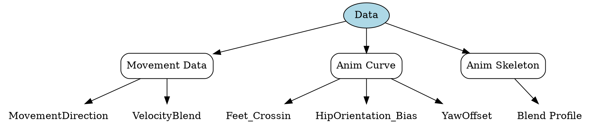
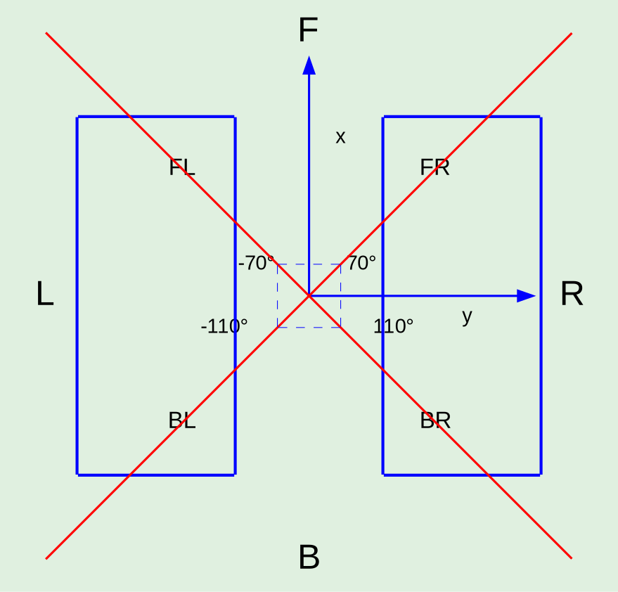

---
tags:
  - knowledge
up: 
PrevNote: "[[框架思考]]"
date created: 2025-03-20
date modified: 2025-03-20
words:
  2025-03-20: 2095
---
> Ciallo ～(∠・ω< )⌒★!

本文讨论基于学习用的 ALSCPP 项目：  
[GitHub - aizawaayame/OnaGameSample: Rewrite the ALS project using C++.](https://github.com/aizawaayame/OnaGameSample)

## 1. 问题

在项目中我们有以下问题：
- 如何在缺少具有方向的八向动画下实现转向?
- 如何解决极端变换下导致的臀位扭转穿帮?
- 如何实现轴心切换时的前倾和后仰?

## 2. 思路

### 2.1. 转向思路

ALS 的只有六个动画。  
分别是正前，正后，左进，左退，右进，右退。实际上只有四个方向的动画。  
为了实现八向动画引入 YawOffset 来实现实际的转向。这个 YawOffset 会在代码中读取，并用于修改角色的 Rot。

### 2.2. 臀位思路

构建六向状态机，通过构造环形变换来限制极端变换的出现。这个见后文实现部分的描述。

### 2.3. 轴心切换思路

实现轴心切换可以在部分状态机切换时触发"pivot"事件，来添加前倾和后仰。后文的状态机切换部分会进行描述。

## 3. 实现

### 3.1. 数据



#### 3.1.1. Movement 数据

##### 3.1.1.1. 移动方向 MovementDirection



计算 VelocityBlend 分为两步：  
计算当前 ControlledRotation 和 VelocityRotation 之间的插值 Delta  
根据 Delta 决定当前的移动方向

##### 3.1.1.2. 速度混合 VelocityBlend

计算 VelocityBlend 分为两步：  
计算目标 VelocityBlend (TargetBlend)  
插值 VelocityBlend

###### 3.1.1.2.1. 获取 TargetBlend

```cpp
const FVector LocRelativeVeclocityDir = CharacterInformation.CharacterActorRotation.UnrotateVector(CharacterInformation.Velocity.GetSafeNormal(0.1f));
  
const float Sum = FMath::Abs(LocRelativeVeclocityDir.X) + FMath::Abs(LocRelativeVeclocityDir.Y) + FMath::Abs(LocRelativeVeclocityDir.Z);  
const FVector RelativeDir = LocRelativeVeclocityDir / Sum;  
FOnaVelocityBlend TargetBlend;  
TargetBlend.F = FMath::Clamp(RelativeDir.X, 0.0f, 1.0f);  
TargetBlend.B = FMath::Abs(FMath::Clamp(RelativeDir.X, -1.0f, 0.0f));  
TargetBlend.L = FMath::Abs(FMath::Clamp(RelativeDir.Y, -1.0f, 0.0f));  
TargetBlend.R = FMath::Clamp(RelativeDir.Y, 0.0f, 1.0f);  
```

**向量归一化**：  
将速度向量归一化后从世界坐标系转换到角色的局部坐标系：
```cpp
const FVector LocRelativeVeclocityDir = CharacterInformation.CharacterActorRotation.UnrotateVector(CharacterInformation.Velocity.GetSafeNormal(0.1f));  
```

**混合方向权重**：  
计算局部空间速度向量各分量绝对值的总和。这里使用绝对值是为了处理负方向值：`const float Sum = FMath::Abs(LocRelativeVeclocityDir.X) + FMath::Abs(LocRelativeVeclocityDir.Y) + FMath::Abs(LocRelativeVeclocityDir.Z); `  
将局部空间速度向量除以前面计算的绝对值总和，得到一个特殊的"归一化"向量：`const FVector RelativeDir = LocRelativeVeclocityDir / Sum;`  
计算混合权重

###### 3.1.1.2.2. 插值 TargetBlend

```cpp
const FOnaVelocityBlend& TargetBlend = CalculateVelocityBlend();  
VelocityBlend.F = FMath::FInterpTo(VelocityBlend.F, TargetBlend.F, DeltaSeconds, Config.VelocityBlendInterpSpeed);  
VelocityBlend.B = FMath::FInterpTo(VelocityBlend.B, TargetBlend.B, DeltaSeconds, Config.VelocityBlendInterpSpeed);  
VelocityBlend.L = FMath::FInterpTo(VelocityBlend.L, TargetBlend.L, DeltaSeconds, Config.VelocityBlendInterpSpeed);  
VelocityBlend.R = FMath::FInterpTo(VelocityBlend.R, TargetBlend.R, DeltaSeconds, Config.VelocityBlendInterpSpeed);
```
利用插值得到更加平滑的结果

#### 3.1.2. 动画曲线

使用了HipOrientation_Bias（臀位朝向）与Feet_Crossing（是否交叉脚）让动画表现层更加顺滑。  
使用 YawOffset 来实现旋转偏移。

##### 3.1.2.1. 交叉脚曲线

**Feet_Crossing**：存在与ALS_N\_\[Walk, Run]\_\[LB, LF, RB, RF]中的曲线，功能是标识什么时候为交叉脚  
1: 交叉脚，切换姿势会穿帮  
0: 非交叉，可以正常进行姿势切换

##### 3.1.2.2. 臀位朝向曲线

**HipOrientation_Bias**：臀部位置  
<-0.5 臀位左  
\>0.5 臀位右

#### 3.1.3. Blend Profile

### 3.2. 表现


#### 3.2.1. States

State 内均采用四方向融合。分别对应 VelocityBlend.F(B，R，L)。  
拥有六种动画资源 F，B，FL，BL，FR，BR。

融合方式采用对角融合，F-B，FL-BR，FR-BL。对角融合才能正确的融合出臀部的位置。  
这样融合方式应该是  
Move F → F，B， FL，RL  
Move B → F，B，FB，RB  
Move LF → F，B，LF，RB  
……

#### 3.2.2. Transition

切换路径是有限制，跳变切换的路径被禁止：  
如没有从 LF →RF 的路径; RF→B 必须途径 RB…

切换规则分为三类：  
**ChangeDirection**：由玩家输入产生的移动意图决定，对操控立即响应，插值生效  
**SwitchHip**：又臀位和交叉脚部判断让融合效果更加自然  

##### 3.2.2.1. ChangeDirection 移动意图变换

由 `MoveDirection` 变量决定，该变量在数据章节中有叙述。会在 `NativeUpdateAnimation` 中进行更新。  
**路径**：这种方式的变换经历所有的合法的变换路径。  
**通知**：在 F←>B，FR←>BL，FL←>BR 会添加"Pivot"事件，通知轴心进行了更改

##### 3.2.2.2. SwitchHip 臀部变换

由 HipOrientation_Bias 和 Feet_Crossing 决定变换。  
Feet_Crossing 是一个消极变量，只有当为 0 时才能切换。原因是交叉脚时转身会出现明显的穿帮。  
在这个变换中，忽略脚部，观察 FL 和 FR，发现一个其实就是左扭屁股，一个是右扭屁股。这个就可以用于类似瞄准等场景。  
**路径**：因为这是由臀位变换导致的，所以只有 FL<→FR，BL←>BR

## 4. Reference

[ALS高级运动系统解析 03 八向移动](https://zhuanlan.zhihu.com/p/638673655)  
[UE4 UE5 骨骼动画 高级运动系统 八向移动](https://zhuanlan.zhihu.com/p/489653380)  
[AdvancedLocomotion 拆解笔记 1：移动](https://zhuanlan.zhihu.com/p/80732458)  
[Site Unreachable](https://zhuanlan.zhihu.com/p/424797720)  
[【新手向】虚幻4ARPG教程-重置版-第七集-使用弓箭时八方向移动状态\_哔哩哔哩\_bilibili](https://www.bilibili.com/video/av80124207/)  
[虚幻4（UE4） 动画技术 深入浅出 高级运动系统\_哔哩哔哩\_bilibili](https://www.bilibili.com/video/BV12f4y1r71N)
