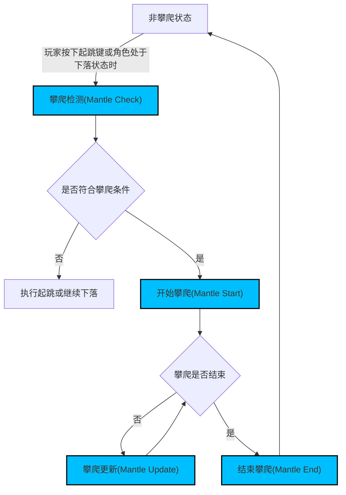

本篇基于 [GitHub - aizawaayame/OnaGameSample: Rewrite the ALS project using C++.](https://github.com/aizawaayame/OnaGameSample/tree/master) 项目。  

具体为 [OnaGameSample/Source/Ona/Private/CharacterLogic/CharacterMovement/OnaMantleComponent.cpp at master · aizawaayame/OnaGameSample · GitHub](https://github.com/aizawaayame/OnaGameSample/blob/master/Source/Ona/Private/CharacterLogic/CharacterMovement/OnaMantleComponent.cpp) 部分



## 绑定和驱动

=== "Ctor"  
    ```cpp  
	PrimaryComponentTick.bCanEverTick = true;  
	PrimaryComponentTick.bStartWithTickEnabled = true;

	MantleTimeline = CreateDefaultSubobject<UTimelineComponent>(NAME_MantleTimeline);
    ```
    <div class="result" markdown>
    :material-numeric-1: 创建 `UTimelineComponent` 对象以供后续驱动使用。
    </div>
=== "BeginPlay"  
    ```cpp  
    FOnTimelineFloat TimelineUpdated;  
    FOnTimelineEvent TimelineFinished;

    TimelineUpdated.BindUFunction(this, NAME_MantleUpdate);
    TimelineFinished.BindUFunction(this, NAME_MantleEnd);

    MantleTimeline->SetTimelineFinishedFunc(TimelineFinished);
    MantleTimeline->SetLooping(false);
    MantleTimeline->SetTimelineLengthMode(TL_TimelineLength);
    MantleTimeline->AddInterpFloat(MantleTimelineCurve, TimelineUpdated);

    OwnerCharacter->JumpPressedDelegate.AddUniqueDynamic(this,
        &UOnaMantleComponent::OnOwnerJumpInput);
    ```
    <div class="result" markdown>
    :material-numeric-1: 绑定 `MantleUpdate` 到  `TimelineUpdate` 事件，绑定 `MantleEnd` 到 `TimelineFinished` 事件。
    
    :material-numeric-2: 绑定 `MantleTimeline` 的 `MantleTimelineCurve` 曲线事件为 `TimelineUpdated`。绑定 `MantleTimeline` 的结束事件为 `TimelineFinished`。

    :material-numeric-3: 绑定 `OwnerCharacter` 的 `JumpPressedDelegate` 事件到 `OnOwnerJumpInput` 方法。
    </div>
=== "Tick"  
    ```cpp  
	if (OwnerCharacter && OwnerCharacter->GetMovementState() == EOnaMovementState::InAir)  
	{  
		if (OwnerCharacter->HasMovementInput())  
		{  
			MantleCheck(FallingTraceSettings, EDrawDebugTrace::Type::ForOneFrame);  
		}  
	}  
    ```  
    <div class="result" markdown>  
    :material-numeric-1: Tick `MantleCheck`  
    </div>

## 攀爬检测(Mantle Check)

检测是否符合攀爬条件。

核心思路是进行射线检测和碰撞检测，判断是否符合攀爬条件。  
如果是，则关闭 `Component` 的 `Tick` 事件，并调用 `MantleStart` 方法。

### 从Pawn位置向前碰撞检测

向前打一个胶囊体来判断前面是否有可攀爬的障碍物。

```cpp
const FVector& TraceDirection = OwnerCharacter->GetActorForwardVector();  
// GetCapsuleBaseLocation 获取 Capsule 底部位置
const FVector& CapsuleBaseLocation = 
	UOnaMathLibrary::GetCapsuleBaseLocation(
		2.f, 
		OwnerCharacter->GetCapsuleComponent());  
	
FVector TraceStart = CapsuleBaseLocation + TraceDirection * -30.f;  
TraceStart.Z += (TraceSettings.MaxLedgeHeight + TraceSettings.MinLedgeHeight) / 2.f;  

FVector TraceEnd = TraceStart + TraceDirection * TraceSettings.ReachDistance;  
float HalfHeight = 1.f + (TraceSettings.MaxLedgeHeight - TraceSettings.MinLedgeHeight) / 2.f;

FHitResult HitResult;  
{  
    const FCollisionShape CapsuleCollisionShape = 
    	FCollisionShape::MakeCapsule(
    		TraceSettings.ForwardTraceRadius, 
    		HalfHeight);  
    		
    const bool bHit = World->SweepSingleByProfile(
    	HitResult, 
    	TraceStart, 
    	TraceEnd, 
    	FQuat::Identity,
	 	MantleObjectDetectionProfile, 
	 	CapsuleCollisionShape, 
	 	Parameters);
}
```

???+ TraceSetting  
	TraceSetting在外部定义，是根据动画来定义的。本项目只有高攀爬和低攀爬两组动画。
	
	:material-numeric-1: *MinLedgeHeight*，最低可攀爬障碍物的高度，低于这个高度就直接走过去，而不触发攀爬。
	
	:material-numeric-2: *MaxLedegeHeight*，最高可攀爬动画，高于这个高度，没有合适的动画进行匹配。
	
	:material-numeric-3: *ForwardTraceRadius*，根据当前角色的胶囊体设计的前向碰撞检测的胶囊体的半径。
	

:material-numeric-1: *Capsule*： 碰撞检测  
	Raduis: 由外部配置 `TraceSetting.FrowarTraceRadius` 决定。  
	Height: 高度就是整个可攀爬范围高度。  
	结合后面的TraceStart.Center的位置这个 Capsule 刚好覆盖整个可攀爬的范围。

:material-numeric-2: *TraceStart*： Center放在可检测范围的中点，起始点有个-30的常量，相比当前角色胶囊体略微靠后。这样能防止角色靠近障碍物碰撞检测打出时 Penetrate 导致不正常触发攀爬。

:material-numeric-3: *TraceEnd*： TraceStart+ TraceDirection * TraceSettings.ReachDistance。ReachDistance由动画的前倾动作来决定。

```cpp
if (!HitResult.IsValidBlockingHit() || OwnerCharacter->GetCharacterMovement()->IsWalkable(HitResult))  
    return false;  
  
if (HitResult.GetComponent() != nullptr)  
{  
    UPrimitiveComponent* PrimitiveComponent = HitResult.GetComponent();  
    if (PrimitiveComponent && PrimitiveComponent->GetComponentVelocity().Size() > AcceptableVelocityWhileMantling)  
    {      
    	 return false;  
    }
}
```

:material-numeric-1: 未检测到障碍物退出。

:material-numeric-2: 障碍物 `Iswalkable` 退出

:material-numeric-3: 障碍物移动速度过快退出

### 从落脚点上方向下碰撞检测

检测落脚点是否能继续行走。

```cpp
const FVector InitialTraceImpactPoint = HitResult.ImpactPoint;  
const FVector InitialTraceNormal = HitResult.ImpactNormal;  
  
FVector DownwardTraceEnd = InitialTraceImpactPoint;  
DownwardTraceEnd.Z = CapsuleBaseLocation.Z;  
DownwardTraceEnd += InitialTraceNormal * -15.0f;  

FVector DownwardTraceStart = DownwardTraceEnd;  
DownwardTraceStart.Z += TraceSettings.MaxLedgeHeight + TraceSettings.DownwardTraceRadius + 1.0f;  

{  
    const FCollisionShape SphereCollisionShape = 
    	FCollisionShape::MakeSphere(TraceSettings.DownwardTraceRadius);  
    const bool bHit = 
    	World->SweepSingleByChannel(
    		HitResult, 
    		DownwardTraceStart, 
    		DownwardTraceEnd, 
    		FQuat::Identity, 
    		WalkableSurfaceDetectionChannel, 
    		SphereCollisionShape);
}
```

???+ "TraceSetting.DownwardTraceRadius"  
	和其他TraceSetting参数一样，在外部配置，该参数由角色的实际大小来决定。

:material-numeric-1: *Sphere*： 碰撞检测  
	Raduis: 由外部配置 `TraceSetting.DownwardTraceRadius` 决定。  

:material-numeric-2: *TraceStart*： $(x，y)$ 的位置根据第一次碰撞结果决定。$Z$ 先算出 `TraceEnd`，再加上 `TraceSettings.MaxLedgeHeight + TraceSettings.DownwardTraceRadius + 1`。

:material-numeric-3: *TraceEnd*：取当前的角色胶囊体底部位置，并添加一个 `InitialTraceNormal * -15` 的偏移。15这个常量来源是源攀爬动画的根位移，执行一个攀爬动作，该动画在 $Y$ 方向上会+15。

```cpp
if (!OwnerCharacter->GetCharacterMovement()->IsWalkable(HitResult))  
{  
    return false;  
}
```

:material-numeric-1: 如果落脚点 `!IsWalkable` 则退出。

### 检测落脚点是否有足够空间

逻辑比较简单，就是在落脚点处构造一个 Capsule 进行碰撞检测。

```cpp
const FVector& CapsuleLocationFromBase = 
	UOnaMathLibrary::GetCapsuleLocationFromBase(
		DownTraceLocation, 
		2.f, 
		OwnerCharacter->GetCapsuleComponent());  
		
const bool bCapsuleHasRoom = 
	UOnaMathLibrary::CapsuleHasRoomCheck(
		OwnerCharacter->GetCapsuleComponent(), 
		CapsuleLocationFromBase, 
		0.f, 
		0.f, 
		DebugType, 
		OnaCharacterDebugComponent && OnaCharacterDebugComponent->GetShowTraces());  
		
if (!bCapsuleHasRoom)  
{  
    return false;  
}
```

### 触发MantleStart方法

触发 `MantleStart`，开始进行攀爬。

```cpp
const FTransform TargetTransform(
	(InitialTraceNormal * FVector(-1, -1, 0)).ToOrientationRotator(),  
    CapsuleLocationFromBase,    
    FVector::OneVector);
    
const float MantleHeight = (CapsuleLocationFromBase - OwnerCharacter->GetActorLocation()).Z;  
EOnaMantleType MantleType;  
if (OwnerCharacter->GetMovementState() == EOnaMovementState::InAir)  
{  
    MantleType = EOnaMantleType::FallingCatch;  
}  
else  
{  
    MantleType = MantleHeight > 125.0f ? EOnaMantleType::HighMantle : EOnaMantleType::LowMantle;  
}

FOnaComponentAndTransform MantleWS;  
MantleWS.Component = HitComponent;  
MantleWS.Transform = TargetTransform;  
MantleStart(MantleHeight, MantleWS, MantleType);
```

 :material-numeric-1: 根据当前状态和攀爬高度决定 `MantleType` (`LowMantle`，`HighMantle`，`FallingCatch`)。

:material-numeric-2: 传递 `HitComponnet`。

:material-numeric-3: 传递 `TargetTransform`，这个参数是根据，`ImpactPoint` 来动态构造的，注意这个 Transform 的 Rotator 的 $(X，Y)$ 和 `ImpactNormal` 的方向是相反的。这样就能指向 `ImpactPoint` 方向。

## 攀爬开始(Mantle Start)
该函数核心作用有两个

:material-numeric-1: 

:material-numeric-2:
### 禁用组件Tick

组件每帧Tick会去进行MantleCheck，在开始攀爬后，暂时禁用Tick。

```cpp
SetComponentTickEnabledAsync(false);
```

### 播放蒙太奇

完成了和动画匹配的Timeline逻辑驱动，执行蒙太奇动画播放。
```cpp
if (MantleParams.AnimMontage && OwnerCharacter->GetMesh()->GetAnimInstance())  
{  
    OwnerCharacter->GetMesh()->GetAnimInstance()->Montage_Play(
				MantleParams.AnimMontage, 
				MantleParams.PlayRate,  
				EMontagePlayReturnType::MontageLength,  
				MantleParams.StartingPosition, 
				false);  
}
```

## 攀爬更新(Mantle Update)

`MantleUpdate` 实际上是由 `MantleTimeline` 进行驱动的。

核心逻辑是 **执行和动画匹配的位移和旋转** 。

## 攀爬结束(Mantle End)

`MantleUpdate` 实际上是由 `MantleTimeline` 进行驱动的。

在 Timeline 播放结束后，会触发该事件。

核心逻辑是重新打开组件的Tick，以使能进行 `MantleCheck`。
```cpp
SetComponentTickEnabledAsync(true);
```
