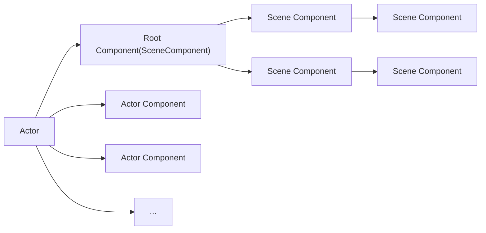

:material-help: **What Is** :  
	Actor 是可以放置在关卡中的任何对象，例如摄像机、静态网格体或玩家起始位置。

:material-help: **What Can Do** :  
	Actor 支持 3D 变换，例如平移、旋转和缩放。  
	Actor 可以通过游戏代码（C++或蓝图）创建（生成）和销毁。  
	Actor 的支持网络复制属性和函数调用。

## 组件

Actor 视为容纳称为组件的特殊类型对象的容器。不同类型的组件可用于控制 Actor 的移动方式、渲染方式等。

:material-numeric-1: `UActorComponent` 是所有组件的基类。

:material-numeric-2: `USceneComponent` 具有变换的 `UActorComponent` 。  
	Actor 的变换由 `USceneComponent` 层级结构根部的 `USceneComponent` 决定。

:material-numeric-3: `UPrimitiveComponent` 是所有图形表示几何组件的基类。

## Root Component

每个 `Actor` 都有一个 `RootComponent` 且 `RootComponent` 必须是 `USceneComponent` 的子类。

```cpp title="RootComponent 的声明"
UPROPERTY(BlueprintGetter=K2_GetRootComponent, Category="Transformation")
TObjectPtr<USceneComponent> RootComponent;

/**
* Sets root component to be the specified component.  NewRootComponent's owner should be this actor.
* @return true if successful
*/
ENGINE_API bool SetRootComponent(USceneComponent* NewRootComponent);
```

Actor本身没有变换，Actor的变换由根 `RootComponent` 决定。

具体来说，如果此 Root Component 是 `SceneComponent`，它将提供 Actor 的变换信息。否则，Actor 将没有变换信息。

```cpp
const FTransform& AActor::GetTransform() const  
{  
    return ActorToWorld();  
}

FORCEINLINE const FTransform& AActor::ActorToWorld() const  
{  
    return (RootComponent ? RootComponent->GetComponentTransform() : FTransform::Identity);  
}
```

<div class="result" markdown>
:material-numeric-1: `AActor::GetTransform()` 返回 `ActorToWorld()` 的结果。

:material-numeric-2: `ActorToWorld()` 返回 `RootComponent` 的变换。如果没有 `RootComponent` ，则返回 `FTransform::Identity` 。
</div>

## 层级结构



## 创建和销毁
