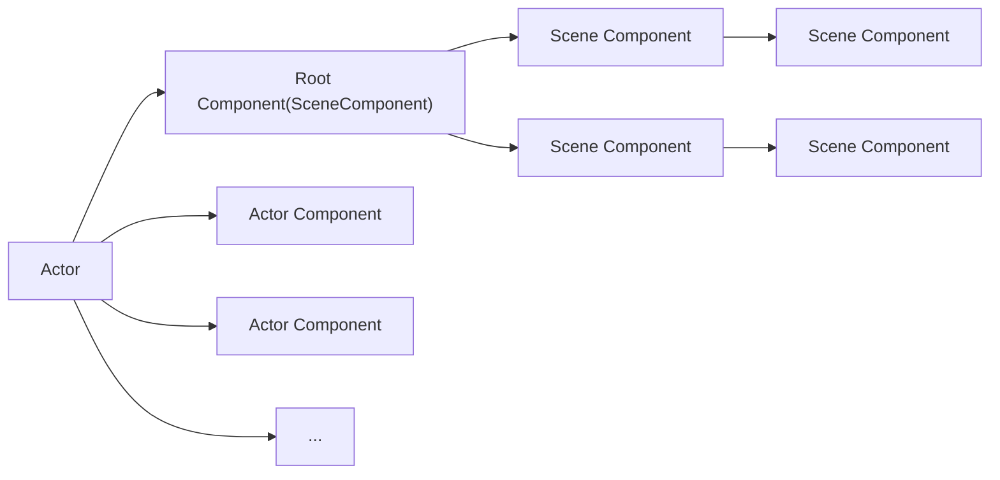

:material-help: **What Is** :  
	Actor 是可以放置在关卡中的任何对象，例如摄像机、静态网格体或玩家起始位置。

:material-help: **What Can Do** :  
	Actor 支持 3D 变换，例如平移、旋转和缩放。  
	Actor 可以通过游戏代码（C++或蓝图）创建（生成）和销毁。  
	Actor 的支持网络复制属性和函数调用。

## 组件

Actor 视为容纳称为组件的特殊类型对象的容器。不同类型的组件可用于控制 Actor 的移动方式、渲染方式等。

:material-numeric-1: `UActorComponent` 是所有组件的基类。

:material-numeric-2: `USceneComponent` 具有变换的 `UActorComponent` 。  
	Actor 的变换由 `USceneComponent` 层级结构根部的 `USceneComponent` 决定。

:material-numeric-3: `UPrimitiveComponent` 是所有图形表示几何组件的基类。

## 根组件

:material-help: **What Is** :  
	每个 `Actor` 都有一个 `RootComponent` 且 `RootComponent` 必须是 `USceneComponent` 的子类。  
:material-help: **What Can Do** :  
	提供世界的 Transform 信息。  
	提供层次化组织 `Components` 和 `Actor` 的能力。

:material-numeric-1: 类型为 `USceneComponent*`，是 `Actor` 的根场景组件，负责定义 `Actor` 在世界中的位置、旋转和缩放。

:material-numeric-2: 所有其他 `USceneComponent` 类型的组件（例如 `UStaticMeshComponent`、`USkeletalMeshComponent`）通过 `AttachToComponent` 形成层次结构，挂接到 `RootComponent` 或其他场景组件。

:material-numeric-3: 如果 `RootComponent` 为 `nullptr`，`Actor` 不会出现在场景中（无法进行变换）。

```cpp title="RootComponent 的声明"
UPROPERTY(BlueprintGetter=K2_GetRootComponent, Category="Transformation")
TObjectPtr<USceneComponent> RootComponent;

/**
* Sets root component to be the specified component.  NewRootComponent's owner should be this actor.
* @return true if successful
*/
ENGINE_API bool SetRootComponent(USceneComponent* NewRootComponent);
```

Actor本身没有变换，Actor的变换由根 `RootComponent` 决定。

具体来说，如果此 Root Component 是 `SceneComponent`，它将提供 Actor 的变换信息。否则，Actor 将没有变换信息。

```cpp
const FTransform& AActor::GetTransform() const  
{  
    return ActorToWorld();  
}

FORCEINLINE const FTransform& AActor::ActorToWorld() const  
{  
    return (RootComponent ? RootComponent->GetComponentTransform() : FTransform::Identity);  
}
```

<div class="result" markdown>
:material-numeric-1: `AActor::GetTransform()` 返回 `ActorToWorld()` 的结果。

:material-numeric-2: `ActorToWorld()` 返回 `RootComponent` 的变换。如果没有 `RootComponent` ，则返回 `FTransform::Identity` 。
</div>

## 组件的绑定和注册

### 静态绑定

:material-numeric-1: 在 Blueprint 或 C++ 类中定义的组件通过 UPROPERTY() 宏标记组件为 AActor 的成员变量。

:material-numeric-2: 在构建函数中通过 `CreateDefaultSubobject` 创建实例绑定到变量。

:material-numeric-3: 如果是 `SceneComponent`，调用 `SetupAttachment` 函数设置层次结构。

???+ SetupAttachment 和 AttachtoComponent  
	`SetupAttachment` 初始化组件预期附加的父组件(和插槽)信息，在组件注册时生效。
	
	<div class="grid cards" markdown>

	- **SetupAttachment**

		---

		:material-numeric-1: 设计上预期在构造函数中创建的组件应使用 SetupAttachment。

		:material-numeric-2: 只是设置预期的附加信息，不会立即执行附加操作。(仅设置`AttachParent`和`AttachSocketName`两个变量，并标记`bShouldBeAttached`)

		???+ quote "Comments In SceneComponent.h"
			Initializes desired Attach Parent and SocketName to be attached to when the component is registered.

			Generally intended to be called from its Owning Actor's constructor and should be preferred over AttachToComponent when a component is not registered.

	- **AttachtoComponent**

		---

		:material-numeric-1: 设计上预期在运行时动态创建的组件应使用 AttachToComponent。

		:material-numeric-2: 会立即执行附加操作。

		:material-numeric-3: 无论是否注册，都可以调用这个方法。但是在注册前优先调用`SetupAttachment`。
		 
		???+ quote "Comments In SceneComponent.h"
			Attach this component to another scene component, optionally at a named socket. It is valid to call this on components whether or not they have been Registered, however from constructor or when not registered it is preferable to use SetupAttachment.

	</div>

### 动态绑定

运行时通过 `AActor::AddComponent` 添加一个新组建到Actor，并分配所有权到该 Actor。

支持自动附加（第一个组件成为根组件，后续组件挂载到根下），但如果设置 `bManualAttachment` 为 `true`，则需要手动处理附加逻辑。

???+ quote "Comment In Actor.h"

	Creates a new component and assigns ownership to the Actor this is called for. 
	
	Automatic attachment causes the first component created to become the root, and all subsequent components to be attached under that root. 
	
	When bManualAttachment is set, automatic attachment is skipped and it is up to the user to attach the resulting component (or set it up as the root) themselves.

### 注册

## 组件和Actor层级结构


