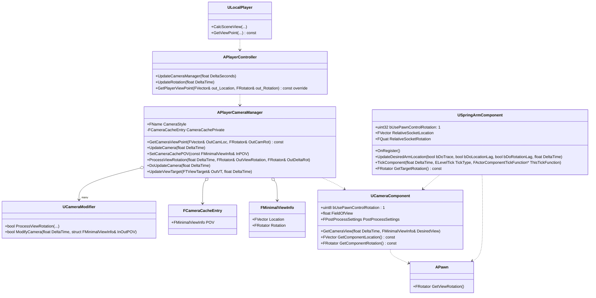
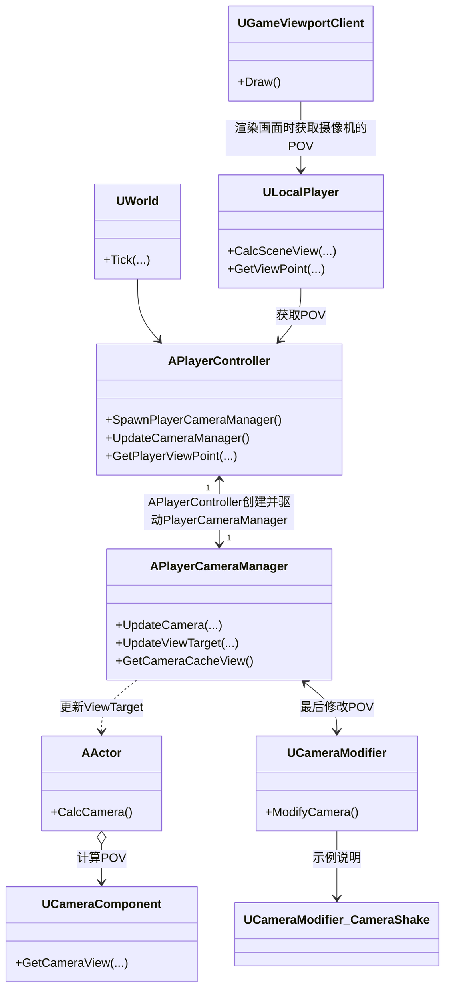

UE的相机系统相比于更加复杂，涉及到 `CameraComponent`，`CameraActor`，`PlayerController`，`PlayerCameraManager` 几个类。





1. **CameraActor**
	1. `CameraComponent` 的包装容器，以使相机可以放置在关卡中。
2. **CameraComponent**
	1. 代表相机的各种数据。
    2. 并不直接处理数据。
3. **PlayerCameraManager**
	1. 相机系统的核心，处理相机数据并应用到 `ViewTarget`。
	2. 管理 **ViewTarget**，记录摄像机跟随对象Target和摄像机POV。

总体流程上：

:material-numeric-1: **初始化ViewTarget**：

`PlayerController` 会在 `PostInitializeComponents` 函数中调用 `SpawnPlayerCameraManager` 函数。

=== "SpawnPlayerCameraManager"

    ```cpp title="APlayerController::SpawnPlayerCameraManager"
    // servers and owning clients get cameras
	// If no archetype specified, spawn an Engine.PlayerCameraManager.  NOTE all games should specify an archetype.
    FActorSpawnParameters SpawnInfo;
	SpawnInfo.Owner = this;
	SpawnInfo.Instigator = GetInstigator();
	SpawnInfo.ObjectFlags |= RF_Transient;	// We never want to save camera managers into a map
	if (PlayerCameraManagerClass != NULL)
	{
		PlayerCameraManager = GetWorld()->SpawnActor<APlayerCameraManager>(PlayerCameraManagerClass, SpawnInfo);
	}
	else
	{
		PlayerCameraManager = GetWorld()->SpawnActor<APlayerCameraManager>(SpawnInfo);
	}

    if (PlayerCameraManager != NULL)
	{
		PlayerCameraManager->InitializeFor(this);
	}
	else
	{
		// log
	}
    ```
    <div class="result" markdown>
    :material-numeric-1: 每个 `PlayerController` 都会在世界创建一个 `PlayerCameraManager` Actor。

    :material-numeric-2: 针对每个创建的 `PlayerCameraManager`，都会调用 `InitializeFor` 函数初始化。
    </div>

=== "InitializeFor"

    ```cpp title="APlayerCameraManager::InitializeFor"
	FMinimalViewInfo DefaultFOVCache = GetCameraCacheView();
	DefaultFOVCache.FOV = DefaultFOV;
	SetCameraCachePOV(DefaultFOVCache);

	PCOwner = PC;

	SetViewTarget(PC);

	// set the level default scale
	SetDesiredColorScale(GetWorldSettings()->DefaultColorScale, 5.f);

	// Force camera update so it doesn't sit at (0,0,0) for a full tick.
	// This can have side effects with streaming.
	UpdateCamera(0.f);
    ```

:material-numeric-2: **更新ViewTarget**：

`UWorld` 会在 `Tick` 函数中调用 `AplayerController::UpdateCameraManager`，驱动 `PlayerCameraManager::UpdateCamera` 更新 `ViewTarget`。

=== "World Tick"

    ```cpp title="UWorld::Tick"
    //...

    for (int32 i = 0; i < LevelCollections.Num(); ++i)
    {
        //...
        // Update cameras last. This needs to be done before NetUpdates, and after all actors have been ticked.
        for( FConstPlayerControllerIterator Iterator = GetPlayerControllerIterator(); Iterator; ++Iterator )
        {
            if (APlayerController* PlayerController = Iterator->Get())
            {
                if (!bIsPaused || PlayerController->ShouldPerformFullTickWhenPaused())
                {
                    PlayerController->UpdateCameraManager(DeltaSeconds);
                }
                else if (PlayerController->PlayerCameraManager && FCameraPhotographyManager::IsSupported(this))
                {
                    PlayerController->PlayerCameraManager->UpdateCameraPhotographyOnly();
                }
            }
        }
        //...
    }
    //...
    ``` 

=== "PlayerController UpdateCameraManager"

    ```cpp title="APlayerController::UpdateCameraManager"
    if (PlayerCameraManager != NULL)
	{
		PlayerCameraManager->UpdateCamera(DeltaSeconds);
	}
    ```

=== "PlayerCameraManager UpdateCamera"

    ```cpp title="APlayerCameraManager::UpdateCamera"
    if ((PCOwner->Player && PCOwner->IsLocalPlayerController()) || !bUseClientSideCameraUpdates || bDebugClientSideCamera)
	{
		DoUpdateCamera(DeltaTime);
        //...
    }
    ```

:material-numeric-3: **应用ViewTarget**：

`UGameViewportClient` 的 `Draw` 方法渲染画面时，会通过 `ULocalPlayer::CalcSceneView` 方法，最终从 `APlayerCameraManager` 中获取 `ViewTarget` 中的POV数据用于渲染。

## 摄像机控制

### 角色旋转控制

### 摄像机旋转控制
